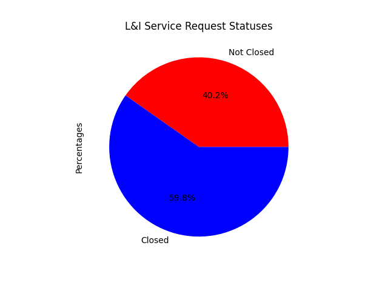
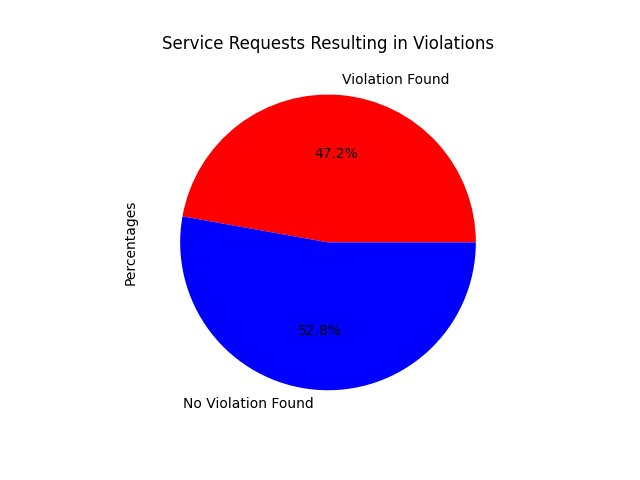

# 311 Service Requests Data Analysis

This is a data engineering task for the City of Philadelphia to help analyze Philly311 service requests that get routed to the department of Licenses and Inspections (L&I).
The requirements of this task involve helping 311 determine the performance of L&I in receiving these service requests and issuing code violations if necessary. Specifically, the task is to find: 
* How many service requests since the beginnning of the year has 311 associated with "License & Inspections" as the agency_responsible?
* What percentage of these service requests have not been closed? (i.e. L&I has not finished inspecting them)
* What percentage of these service requests have resulted in the issuance of a code violation?


## Approach

### Getting familiar with the data and APIs
To begin this task, I knew I would have to interact with the various datasets and APIs provided by the City of Philadelphia so my first step was to familiarize myself with the data and the APIs. These are the webpages that I used to do this:
* [Visualization](https://data.phila.gov/visualizations/311-requests/) The visualization website provided by the City of Philadelphia allowed me to get a quick look at a small subset of the data for both 311 service requests and violations. With this, I could pinpoint important fields that I would need for my data analysis like status and agency_responsible.
* [Metadata Catalog](https://metadata.phila.gov/#home/datasetdetails/5543864d20583086178c4e98/representationdetails/5762e19fa237544b2ecfe722/) Looking at the metadata for each dataset allowed me to dig deeper into what each field contained and helped me clarify confusing concepts to me like the difference between cases and violations by providing detailed descriptions
* [Carto API](https://cityofphiladelphia.github.io/carto-api-explorer/#public_cases_fc) Through the API explorer, I was able to understand Carto's SQL API that I would end up using to pull the datasets I needed for this task. 
* [AIS API Documentation](https://github.com/CityOfPhiladelphia/ais/blob/master/docs/APIUSAGE.md) Using the AIS API usage documentation provided by the City of Philadelphia on the associated Github page, I was able to understand the possible responses and properties that I would receive when calling the AIS API to obtain opa_account_num from address. 

### Choice of language and programmatic approach
For this task, no language was specified so I ended up choosing Python. From prior experience using Python in data science and machine learning settings, I knew there were existing Python packages that would be suitable to assisting me with this task. In particular, I knew __pandas__ would be a good choice for storing and reading the datasets from csv files as well as analyzing the data. I also knew of the __requests__ package that would help with sending the http requests needed to work with the APIs. 
 
Once I started programming, I split the task into two parts: data retrieval and data analysis
* __Data Retrieval__: When thinking through the task, I knew a potential point of complication was that in order to join the service request dataset with the violations dataset, I would need to use the AIS API to get the opa_account_num corresponding to each service request. Otherwise, getting the data for this task would have been relatively straightforward by just using SQL joins with the Carto API. I decided to save the datasets as csv files, create a new column for the service requests to store the opa_account_num, and then use the opa_account_num columns for both datasets to join the datasets together. When populating the opa_account_num, I kept a dictionary linking addresses to opa_account_nums so that if there were any repeat addresses in the data, I wouldn't need to call the AIS API again to retrieve the opa_account_num. Finally, with joining the datasets together, I filtered out any rows where the violation date occurred before the service requested since I knew one of the metrics we were looking for is what percentage of service requests resulted in the issuance of a code violation.
* __Data Analysis__: Once all of the data was loaded, the actual analysis of the data was straightforward. Finding the total number of cases where L&I were responsible was simply counting the number of rows in the service request dataset since I filtered out service requests attributed to other agencies when retrieving the data. Finding the percentage of not closed cases was just counting the number of service requests with that status. Finally, finding the percentage of service requests that resulted in issuing a code violation was achieved by counting the number of distinct service requests in the joined dataset. 

## Assumptions and Limitations
Throughout this task, several assumptions were made to simplify and enable data analysis:
* __Determining if a service request resulted in the issuance of a code violation__: Looking through the datasets, I noticed that there was no explicit foreign key that would link a service request with any specific code violation. So, I made the assumption that if a service request and a violation shared their opa_account_num, which indicates that they correspond to the same address, and if the violation happened after the service request was requested, then we could say that the service request resulted in the code violation. On one hand, this would mean that there could be false positives where a service request would be counted as resulting in a code violation (ex: one service request was issued for a specific address in January but no violation was found. A second request for that address was requested in August and a code violation was found. With the assumption I made, the first service request would be erroneously counted as resulting in a code violation). On the other hand, there's insufficient data to more accurately link service requests to violations so this approximation would be the closest we can get. 
* __Clean and well-formed data__: Finding violations associated with service requests only works if the address for the service request is accurate and well-formed. Within the data, some requests had addresses missing or incorrectly stored so there was no way to use the AIS API to get an accurate opa_account_num. So, there may be additional code violations associated with service requests that had missing address data.
* __Uniqueness of data__: It's assumed that there are no duplicate service requests found within the corresponding dataset.
* __API uptime__: For any of the data retrieval to work, it's assumed that the carto and AIS APIs are up and running.


## Results
With 311DataAnalysis as the working directory, running:
```
python src/main.py
``` 
will retrieve all of the data and perform the data analysis. Note that this will take awhile to run because the datasets are large and retrieving opa_account_nums is rate-limited to prevent any issues for the AIS API. 

In the output directory of the project, you will find __findings.txt__ which lists all the metrics. Specifically:
```
45656 service requests were found with License & Inspections responsible for the year 2025.
18374 service requests, or 40.24%, have not been closed.
21542 service requests, or 47.18%, have resulted in the issuance of a code violation.
```

You will also find the following plots to help visualize the metrics:




## Potential Areas of Improvement
Given more time, here are some areas of improvement that I would implement to improve this project:
* __Allow user input to specify parameters__: Since the task was very explicit on what metrics to gather for specifically data in 2025, I decided to keep things simple and not allow configuration like allowing the user to specify the year or to specify only running the data analysis for instance. 
* __Multithreading/Multiprocessing AIS API requests__: The performance bottleneck of this task is definitely making the calls to the AIS API to find opa_account_num for each service request since there is a large quantity of service requests. Since instructions included limiting the rate to 10 calls/sec., I don't believe much clock time was lost by calling the API sequentially, but in general it could be better practice to run multiple processes to call the API to prevent any stalling from waiting on network responses.
* __Having a better heuristic for associating violations with service requests__: Only checking if the violation date occurred after the service request was requested isn't a fully accurate way to determine that a service request resulted in the issuance of a code violation. I considered checking for violations between the service request requested_datetime and the expected_datetime, but noticed when looking through the data that there are definitely times where violations were issued much after the expected datetime. In this scenario, I would either want to gain more functional area knowledge to see if I could come up with a better heuristic for associating violations with service requests, or communicate with my end-users to see if we could come up with a more precise metric to track given the data that we have.